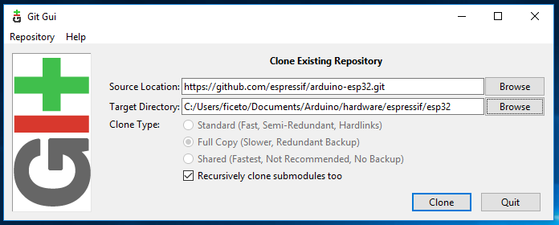

# ae86

## 1、介绍

自研小车，包括控制芯片程序、摄像头程序、硬件组装方法等

## 2、软件架构

软件架构说明

## 3、Arduino 使用说明

### （1）Arduino IDE 配置

IDE 版本要求 1.8 及以上

安装方法见： <link>https://docs.espressif.com/projects/arduino-esp32/en/latest/installing.html</link>

- 使用 IDE 自带工具安装 esp32 开发板库

<pre>
* 配置Boards Manager URLs : https://espressif.github.io/arduino-esp32/package_esp32_index.json
* 工具 -> 开发板管理器： esp32
* 选择对应版本并安装
</pre>

支持 win7 的版本：<pre>git checkout 1.0.6</pre>

或者最新版本：<pre>git checkout 2.0.\*</pre>

查看源码

git 仓库：<link>https://gitee.com/mirrors/arduino-esp32</link>

或者 git 仓库<link>https://github.com/espressif/arduino-esp32</link>

- 自助安装 esp32 开发库

esp32 开发库安装目录：
`[ARDUINO_SKETCHBOOK_DIR]/hardware/espressif/esp32`，
其中`[ARDUINO_SKETCHBOOK_DIR]`一般是指`C:/Users/[YOUR_USER_NAME]/Documents/Arduino`，可以在 IDE 的“首选项”里查看；
（如果是`portable`那么`[ARDUINO_SKETCHBOOK_DIR]`就是`portable/sketchbook`）

git 仓库 clone 到安装目录

在安装目录开启 cmd，执行`git submodule update --init --recursive`

最后执行`tools/get.exe`

### （2）摄像头开发板

工具 -> 开发板 -> ESP32 Arduino -> AI Thinker ESP32-CAM

- ESP32-D0WDQ6 (revision 1)
- Features: WiFi, BT, Dual Core, 240MHz
- Crystal is 40MHz
- Flash size: 4MB
- baud rate 460800

### （3）MH-ET ESP32 开发板（电压检测、红外）

1. 开发板类型： ESP32 Dev Module
2. 管脚：ESP32 DEVKIT PINOUT
3. 模组：[ESP32-WROOM-32E](https://www.espressif.com.cn/sites/default/files/documentation/esp32-wroom-32e_esp32-wroom-32ue_datasheet_cn.pdf")

## 4、开发目录说明

### （1） carCtl-nodeMCU

自制简单小车控制代码

- wifi 配置文件：carCtl-nodeMCU\car\start.lua
- 修改 WIFI 的 ssid 和 pwd 参数

### （2） esp32Cam-ws

Websocket 版 cam，可以通过 websocket 获取图像数据，可以通过 udp 控制 led 灯。

- wifi 配置在目录下新建 wifi_config.h
<pre>
const char* ssid = ;
const char* password = ;
</pre>

### （3） ESP32cam-rtsp

RTSP 版 cam，可以通过 rtsp 协议获取图像数据，并包含完整的 HTTP 摄像头服务

- wifi 配置在目录下新建 wifikeys.h
<pre>
const char *sta_ssid = "******";
const char *sta_password = "******";
const char *ap_ssid = "******";
const char *ap_password = "******";
</pre>

### （4）esp32Camera

完整的 HTTP 摄像头服务

- wifi 配置在目录下新建 wifi_config.h
<pre>
const char *sta_ssid = "******";
const char *sta_password = "******";
</pre>

### （5）IRReceive

红外接收器端

### （6）IRSend

红外发射端

### （7）IRSendAndReceive

红外发射和接收聚合

### （8）sensorModuleTimesTest

电压检测模块的测试代码

### （9）voltage

电压检测模块的正式代码

### (10) MiniCarDemo

控制小车的安卓客户端

### (11) VSCode

* c_cpp_properties.json
  <code>
    <pre>
      "includePath": [
        "${workspaceFolder}/**",
        "E:\\iot\\arduino-1.8.19\\portable\\**",
        "E:\\iot\\arduino-1.8.19\\tools\\**",
        "E:\\iot\\arduino-1.8.19\\hardware\\**"
      ]
    </pre>
  </code>
